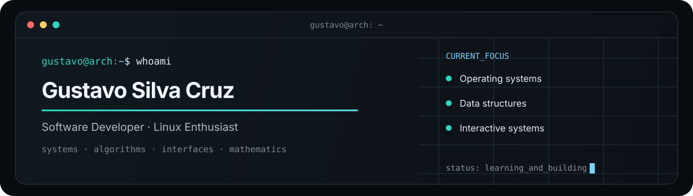

<div align="center">



<br />

<a href="https://github.com/Gustavosilcruz?tab=repositories"></a>

</div>

## `./about`

Desenvolvedor de software interessado no que existe abaixo das abstrações. Construo aplicações web, automações e interfaces enquanto aprofundo fundamentos de sistemas, algoritmos e matemática.

```c
while (curiosity) { study(); build(); measure(); improve(); }
```

## `./now`

| Foco | Explorando |
| --- | --- |
| **Sistemas** | processos, memória, Linux e redes |
| **Ciência da Computação** | estruturas de dados, algoritmos e complexidade |
| **Engenharia** | arquitetura, integrações e interfaces interativas |
| **Matemática** | lógica, matemática discreta e álgebra linear |

## `./building`

- **AgentSpace** — plataforma multiempresa com agentes, dashboards e uma sede digital interativa.
- **Automation Workflows** — integrações confiáveis entre APIs, webhooks, n8n e bancos de dados.
- **Interactive Interfaces** — experimentos com grids 2D, ambientes isométricos e visualização de dados.

## `./toolbox`

<p align="center">
  
</p>

<details>
<summary><strong>Ver stack e ferramentas</strong></summary>

| Área | Tecnologias |
| --- | --- |
| Frontend | React, Vite, Tailwind CSS, Three.js, Babylon.js |
| Backend | Node.js, REST APIs, webhooks, n8n |
| Dados | PostgreSQL, Supabase, SQL |
| Ambiente | Arch Linux, Wayland, Sway, Bash, Docker |

</details>

<details>
<summary><strong>Princípios de engenharia</strong></summary>

```text
entender antes de abstrair · medir antes de otimizar
fluxos explícitos · componentes pequenos · evolução incremental
```

</details>

---

<p align="center"><sub>rooted in fundamentals · driven by curiosity · built with intention</sub></p>
